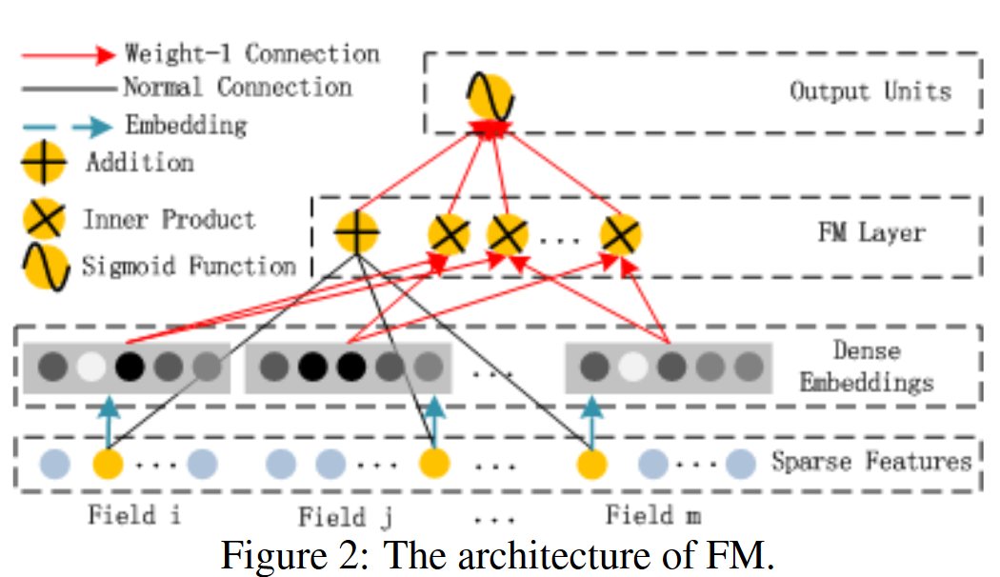
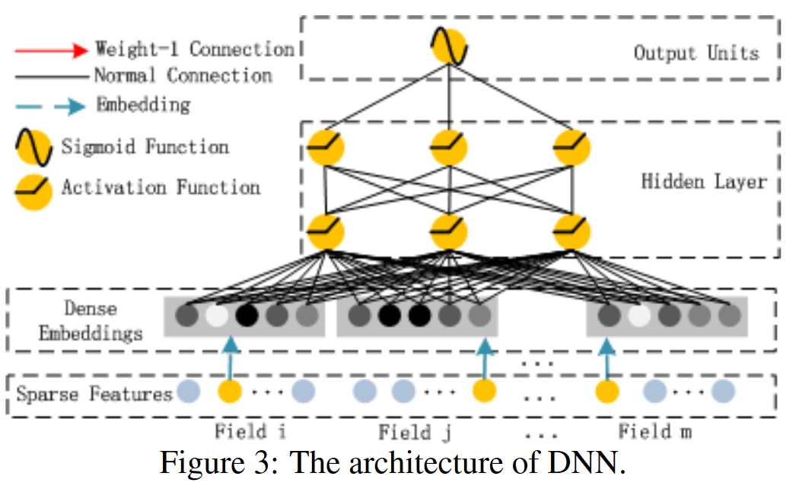

## 推荐部分

> 推荐模型选用了2017年华为诺亚方舟提出的**DeepFM**，是由**DNN+FM**组成的模型

### FM(特征交叉)

> FM的结构大致是: 输入层$\rightarrow$Embedding层$\rightarrow$特征交叉FM层$\rightarrow$输出层
>
> 交叉的部分是类别特征，数值特征不参与交叉。但是如果将数值特征离散化后加入Embedding层，就可以参与交叉。

1. FM模型的方程式为: $y=w_0+\sum\limits_{i=1}^{n}w_ix_i+\sum\limits_{i=1}^{n}\sum\limits_{j=i+1}^{n}<v_i,\ v_j>x_ix_j$，时间复杂度为$O(kn^2)$,其中$v_i$是第$i$维特征的隐向量。经过化简得到: $y=w_0+\sum\limits_{i=1}^{n}w_ix_i+\frac{1}{2}\sum\limits_{f=1}^{k}[(\sum\limits_{i=1}^{n}v_{i,f}x_i)^2-\sum\limits_{i=1}^{n}v_{i,f}^2x_i^2]$，时间复杂度降为$O(kn)$
2. FM用于ranking task的时候可以使用**成对分类函数**作为损失函数
3. FM训练算法可以是`SGD`(随机梯度下降法)
4. FM特征工程: 类别特征One-Hot化(比如实验给出的dataset里的User、Book)、Time可以根据天数离散化分桶

### DNN

